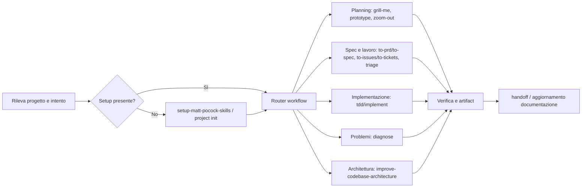
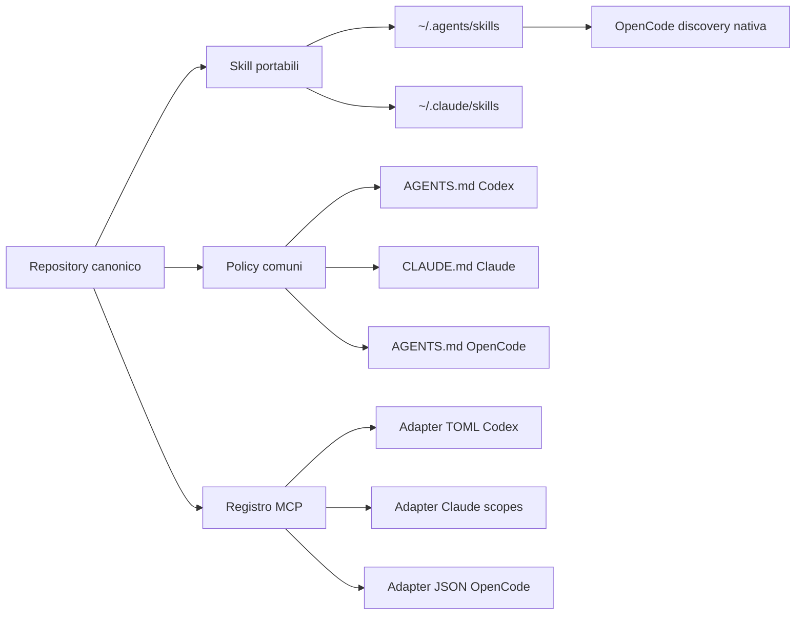

# Orditra — configurazione unificata e distribuibile per Codex, Claude Code e OpenCode

> Stato (2026-08-12): piano implementato e consolidato nell'architettura schema-v2. Per l'uso corrente vedere `README.md`; per componenti, confini e flussi vedere `docs/architecture.md` e `docs/workflows.md`. Questo file resta come specifica storica e rationale di progetto.

Data dell'analisi: 12 agosto 2026  
Stato: implementato, applicato localmente e pubblicato

## Obiettivo

Creare una configurazione personale unica, versionata e ripetibile per Codex, Claude Code e OpenCode che:

- usi `context-mode` per proteggere il context window e mantenere continuità tra sessioni;
- usi Serena per navigazione e modifica semantica a livello di simboli;
- usi ast-grep per ricerca e trasformazioni strutturali;
- renda disponibili le skill di Matt Pocock e le skill personali senza copie divergenti;
- conservi adapter specifici per ogni client, invece di forzare lo stesso formato su prodotti diversi;
- non inserisca credenziali, cache, sessioni o memorie nel repository;
- sia idempotente, verificabile e ripristinabile.
- possa essere installata, aggiornata e rimossa facilmente da altre persone senza modifiche manuali alle proprie home.

L'obiettivo realistico non è far leggere a tutti i client un singolo file nativo: i loro formati e scope sono diversi. La soluzione è avere una singola sorgente dichiarativa e generare o collegare gli artefatti supportati da ogni client.

## Stato rilevato sulla macchina

| Componente | Stato rilevato |
|---|---|
| Codex CLI | `0.146.0`, installato in `~/.local/bin/codex` |
| Claude Code | `2.1.220`, installato in `~/.local/bin/claude` |
| OpenCode | `1.17.7`, installato via Homebrew |
| context-mode | `1.0.169`; doctor completamente OK su Codex |
| Serena | `1.5.3`; backend LSP e configurazione globale in `~/.serena/serena_config.yml` |
| ast-grep | `0.43.0`; disponibili sia `sg` sia `ast-grep` |
| Runtime | Node `24.18.0`, Bun `1.3.14`, uv/uvx `0.11.8`, mise `2026.4.16` |
| Modelli locali | Ollama `0.30.0` presente; CLI LM Studio non rilevata |

Situazione delle integrazioni:

- Codex ha già il plugin `context-mode`, `hooks = true` e `plugin_hooks = true`.
- Il doctor di context-mode conferma FTS5, storage, MCP e hook `PreToolUse`, `PostToolUse`, `SessionStart`, `PreCompact`, `UserPromptSubmit` e `Stop` funzionanti.
- Claude Code ha `context-mode@context-mode` abilitato e possiede hook globali.
- OpenCode non ha ancora context-mode come plugin; il suo config globale contiene soltanto l'MCP `Neon`.
- Serena è installata e configurata, ma non risulta registrata come MCP globale nei tre client.
- `~/.agents/skills` contiene 32 skill; `~/.claude/skills` ne contiene 20.
- Le 20 skill comuni sono 19 copie identiche; soltanto `framer` è divergente.
- Non esiste `~/.config/opencode/skills`, ma OpenCode scopre già ufficialmente `~/.agents/skills` e `~/.claude/skills`: non serve crearne una terza copia.
- Non sono installati né chezmoi né GNU Stow.

## Decisioni architetturali

### 1. Repository Git come sorgente di verità

Usare questo repository come sorgente canonica, con una struttura simile alla seguente:

```text
agent-config/
├── README.md
├── LICENSE
├── SECURITY.md
├── CHANGELOG.md
├── .gitignore
├── .gitattributes
├── .github/
│   └── workflows/
│       ├── validate.yml
│       └── release.yml
├── packages/
│   ├── cli/                 # installer e comandi di gestione
│   ├── core/                # schema, merge e logica condivisa
│   └── adapters/
│       ├── codex/
│       ├── claude/
│       └── opencode/
├── presets/
│   ├── minimal.yaml
│   ├── recommended.yaml
│   └── full.yaml
├── registry/
│   ├── mcp.yaml
│   ├── tools.yaml
│   ├── workflows.yaml
│   ├── skill-sources.lock.yaml
│   └── versions.lock.yaml
├── policies/
│   ├── core.md
│   ├── context-routing.md
│   └── code-search-routing.md
├── skills/
│   ├── context-mode-routing/
│   ├── serena/
│   ├── structural-code-search/
│   └── ...
├── clients/
│   ├── codex/
│   ├── claude/
│   └── opencode/
├── ast-grep/
│   ├── base-sgconfig.yml
│   └── rules/
├── scripts/
│   ├── bootstrap
│   ├── render-configs
│   ├── doctor
│   ├── backup
│   └── rollback
├── tests/
│   ├── fixtures/
│   └── smoke/
└── local-state/             # ignorata da Git
    └── install-manifest.json
```

`registry/mcp.yaml` sarà il file unico da modificare per aggiungere, rimuovere o cambiare un MCP. Gli script renderizzeranno soltanto i frammenti di configurazione di nostra proprietà e conserveranno le impostazioni estranee già presenti.

### 1.1 GitHub come distribuzione e disaster recovery

Il repository deve essere progettato per essere clonato da GitHub su una macchina nuova e ricostruire l'ambiente con un bootstrap. La visibilità sarà **public** fin dal primo push. “Public-safe” è quindi un requisito bloccante, non un controllo rinviabile: nomi di clienti o progetti, endpoint interni, path personali non necessari e dettagli dell'infrastruttura devono essere sostituiti con placeholder o overlay locali ignorati da Git.

Prima di creare il remote pubblico bisogna costruire una cronologia Git pulita: un segreto rimosso dall'ultimo commit ma presente in un commit precedente resta recuperabile. Backup e configurazioni reali non devono mai entrare nemmeno temporaneamente nello staging o nella history.

Devono essere versionati:

- registry dichiarativi e lock delle versioni;
- policy e wrapper per client;
- skill canoniche, script, reference, asset e licenze;
- template ast-grep e regole riutilizzabili;
- renderer, bootstrap, doctor, rollback e relativi test;
- fixture sintetiche e documentazione delle decisioni;
- esempi di profili macchina privi di valori sensibili.

Non devono essere versionati:

- `~/.codex/auth.json`, `~/.claude.json` e qualsiasi file di login/token;
- header `Authorization`, API key, cookie o variabili d'ambiente valorizzate;
- sessioni e indice context-mode;
- memorie, cache, log e dashboard Serena;
- cronologia conversazioni e progetti recenti dei client;
- backup locali e `local-state/install-manifest.json`;
- configurazioni renderizzate che contengono stato scritto dai client;
- path o hostname personali non necessari alla riproducibilità.

La directory di clone consigliata è stabile, per esempio `~/.config/agent-config`. Il bootstrap deve comunque funzionare da qualsiasi path, risolvendo la propria root senza hard-code.

Modalità di distribuzione:

- skill e file di istruzioni controllati esclusivamente da noi: symlink dal client al clone Git;
- file che i client modificano autonomamente, come JSON/TOML globali: merge strutturale generato, non symlink del file intero;
- differenze per macchina: overlay locale ignorato da Git, con un corrispondente file `.example` versionato;
- credenziali: Keychain/login nativo o variabili d'ambiente, mai template con valori reali;
- aggiornamenti: branch dedicato, diff revisionabile, smoke test e merge su `main`.

La GitHub Action `validate.yml` dovrà almeno:

1. validare YAML, JSON/JSONC e TOML di esempio;
2. validare frontmatter e struttura delle skill;
3. eseguire i test dei renderer e verificarne l'idempotenza;
4. controllare link e script essenziali;
5. eseguire una scansione segreti;
6. fallire se un file proibito o una configurazione renderizzata locale entra nel commit.

Inoltre, il repository pubblico deve includere `LICENSE` e `SECURITY.md`, abilitare secret scanning e push protection su GitHub, ed eseguire lo stesso scanner anche localmente prima del commit. Le fixture devono usare esclusivamente domini riservati come `example.com`, username fittizi e path portabili.

Flusso di una nuova macchina:

```text
git clone -> scripts/bootstrap --check -> preview del piano
          -> scripts/bootstrap --apply -> symlink + merge config
          -> scripts/doctor -> smoke test Codex/Claude/OpenCode
```

Il clone Git è la sorgente di verità; le home dei client sono target di deploy. Non bisogna mai fare il percorso inverso copiando automaticamente tutto ciò che appare nelle home dentro Git.

### 1.2 Esperienza di installazione per altri utenti

Il progetto deve avere due modalità distinte:

1. **Consumer mode**: l'utente installa una release e mantiene soltanto le proprie preferenze; non deve forkare il repository.
2. **Contributor/fork mode**: chi vuole cambiare skill, adapter o preset lavora su un fork e può usare la propria sorgente Git.

L'MVP deve offrire una CLI Node/TypeScript pubblicata su npm e richiamabile senza installazione permanente. Node è già un prerequisito di context-mode; usare una sola CLI evita una catena fragile di script `curl | bash`.

Quick start previsto, con nome package da scegliere prima della pubblicazione:

```bash
npx <package-name>@latest install --preset recommended
npx <package-name>@latest doctor
```

Comandi minimi:

| Comando | Funzione |
|---|---|
| `install` | Rileva i client, mostra il piano, crea backup e applica adapter/symlink |
| `init` | Crea o modifica la configurazione personale dell'utente |
| `diff` | Mostra cosa cambierebbe senza scrivere |
| `doctor` | Verifica binari, versioni, plugin, MCP, skill, hook e symlink |
| `update` | Aggiorna core/skill rispettando lock e override locali |
| `project init` | Prepara opzionalmente un nuovo repository |
| `rollback` | Ripristina l'ultimo snapshot applicato |
| `uninstall` | Rimuove solo gli artefatti posseduti dal toolkit e ripristina il precedente stato |

Ogni comando mutante deve supportare `--dry-run`, `--yes` per CI e output machine-readable con `--json`. `install`, `update` e `uninstall` devono essere transazionali: se uno step fallisce, non devono lasciare una configurazione parzialmente applicata.

Preset pubblici:

- `minimal`: policy leggere e skill portabili, senza installare dipendenze esterne;
- `recommended`: context-mode, Serena, ast-grep e una selezione curata di skill;
- `full`: tutte le integrazioni opzionali compatibili con i client rilevati;
- `custom`: selezione interattiva componente per componente.

Il preset `recommended` deve essere il percorso documentato e meglio testato. Deve includere il workflow engineering di base (setup, pianificazione, implementazione, diagnosi, verifica e handoff), non soltanto installare tool. `full` non deve significare “abilita ogni MCP”: i server costosi, autenticati o specifici di un servizio restano opt-in.

La configurazione del consumatore deve essere separata dal package installato:

```text
~/.config/<package-name>/config.yaml         # preferenze portabili
~/.config/<package-name>/config.local.yaml   # path/segreti locali, ignorato da Git
~/.config/<package-name>/state/              # backup e manifest di proprietà
```

`config.yaml` può essere versionato nel fork/dotfiles dell'utente; `config.local.yaml` e `state/` non devono esserlo. Il formato deve essere versionato con `schemaVersion` e migrazioni esplicite.

### 1.3 Un core, tre adapter e package nativi opzionali

La CLI universale è la sorgente di installazione primaria. Gli adapter trasformano lo stesso modello canonico nei formati ufficiali di Codex, Claude Code e OpenCode. Questo impedisce che tre installer indipendenti divergano.

In una seconda release si possono offrire entry point native:

- marketplace/plugin Codex contenente soltanto gli asset compatibili con Codex;
- marketplace plugin Claude Code;
- plugin OpenCode pubblicato su npm.

Questi package devono essere build artifact generati dallo stesso core, non copie mantenute manualmente. Non devono inglobare o rinominare context-mode, Serena, ast-grep o le skill di terzi: li dichiarano come dipendenze/integrazioni, rispettano le licenze upstream e usano i canali d'installazione ufficiali.

Per il primo rilascio è preferibile la CLI multipiattaforma; i package nativi arrivano dopo che install, update e rollback sono stabili.

### 1.4 Versioni, release e compatibilità

- usare Semantic Versioning per CLI, schema e preset;
- pubblicare GitHub Release e package npm dalla stessa tag firmata;
- generare changelog e checksum/provenance degli artifact;
- mantenere una matrice di compatibilità con versioni minime di Codex, Claude Code, OpenCode, Node, Serena e ast-grep;
- bloccare le versioni upstream nel lock, senza aggiornamenti invisibili;
- fornire migrazioni forward e rollback per ogni breaking change;
- testare inizialmente macOS e Linux; dichiarare Windows experimental finché la CI e i path non sono coperti;
- non raccogliere telemetria per default; qualsiasi diagnostica condivisa deve essere esplicita e redatta.

L'utente deve poter aggiornare senza perdere personalizzazioni. La precedenza sarà:

```text
default del core < preset < config utente < config locale < flag CLI
```

### 1.5 Criteri di semplicità misurabili

Il progetto è “easy to manage and install” soltanto se supera questi criteri:

- installazione recommended su una macchina pulita in meno di cinque minuti, esclusi login OAuth manuali;
- nessuna modifica manuale richiesta a JSON, TOML, `AGENTS.md` o `CLAUDE.md`;
- seconda esecuzione senza diff;
- `doctor` indica problemi e comando di correzione senza esporre segreti;
- update con anteprima e changelog;
- uninstall completo degli asset posseduti, senza rimuovere configurazioni preesistenti;
- bootstrap verificato in CI da home temporanee e config preesistenti simulate;
- quick start principale contenuto in tre comandi o meno.

### 2. Condividere le skill, non le intere home dei client

Le skill portabili devono seguire il sottoinsieme comune della [specifica Agent Skills](https://agentskills.io/specification): `name`, `description`, eventuali `license`, `compatibility`, `metadata`, più `scripts/`, `references/` e `assets/` caricati progressivamente.

Strategia proposta:

- `skills/` nel repository è la copia canonica editabile.
- `~/.agents/skills` punta alle skill canoniche.
- `~/.claude/skills` punta alle stesse skill canoniche, salvo adapter dichiaratamente Claude-specifici.
- OpenCode non riceve una copia: usa la discovery nativa di `~/.agents/skills`.
- `~/.codex/skills/.system` non viene toccata: contiene skill gestite da Codex.
- Le skill distribuite da plugin restano gestite dai rispettivi plugin e non vengono duplicate nel repository.

Prima della convergenza bisogna confrontare e decidere quale versione di `framer` conservare. Le altre 19 copie comuni possono essere consolidate automaticamente dopo backup e verifica hash.

Non è consigliato symlinkare interamente `~/.codex`, `~/.claude` o `~/.config/opencode`: contengono formati, cache, stato, credenziali e dati con cicli di vita differenti.

### 2.1 Le skill come orchestrazione naturale del lavoro

Le skill di Matt Pocock e le skill analoghe sono parte del flow predefinito. Non devono vivere come catalogo separato che l'utente deve ricordarsi di invocare. Il toolkit deve collegare intento, stato del progetto e prerequisiti alla skill corretta, mantenendo però la progressive disclosure: all'avvio si caricano solo nome e descrizione, mentre il corpo della skill e le reference vengono letti soltanto quando servono.

`registry/workflows.yaml` descriverà il grafo di workflow senza inserire campi proprietari incompatibili nei `SKILL.md`. Per ogni skill registrerà:

- identificatore canonico e possibili alias tra versioni upstream;
- sorgente, licenza, versione/commit e hash;
- fasi in cui è applicabile;
- intent e trigger positivi;
- prerequisiti di progetto e skill dipendenti;
- artifact o stato prodotto;
- conflitti e condizioni in cui non deve essere caricata;
- supporto verificato per Codex, Claude Code e OpenCode.

Flow engineering raccomandato:



I nomi duplici nel diagramma coprono la raccolta attualmente installata e le rinomine dell'upstream corrente. Il lock e le migrazioni devono stabilire quale nome è effettivamente disponibile; i prompt globali non devono hard-codificare skill inesistenti.

“Integrazione naturale” significa:

- su un nuovo repository, `project init` configura una volta issue tracker, label e layout documentale;
- davanti a un piano incerto, il router rende disponibili le skill di grilling/prototyping;
- una richiesta di bug attiva il flow `diagnose`, e `tdd` solo quando la correzione richiede codice e test;
- una specifica approvata può diventare ticket indipendenti senza ricopiare il contesto;
- Serena e ast-grep sono strumenti usati *dentro* le skill quando servono, mentre context-mode protegge l'output e la continuità dell'intero flow;
- la conclusione aggiorna artifact/documentazione e propone `handoff` quando il lavoro passa a un'altra sessione o persona.

Non significa eseguire tutta la pipeline per ogni richiesta. Il router deve saltare gli step irrilevanti, rispettare l'invocazione esplicita dell'utente e non far partire workflow mutanti senza lo scope necessario.

La qualità del routing va testata con eval versionate: prompt che devono attivare una skill, prompt che non devono attivarla, collisioni tra due skill e casi in cui mancano prerequisiti. Le stesse eval devono essere eseguite contro i metadata generati per i tre client.

### 3. Policy comune con wrapper sottili per client

`policies/core.md` conterrà soltanto regole davvero universali. Ogni client avrà un wrapper breve:

- `~/.codex/AGENTS.md`: routing e convenzioni espresse con i nomi/scope di Codex;
- `~/.claude/CLAUDE.md`: preferenze globali Claude e import dei riferimenti necessari;
- `~/.config/opencode/AGENTS.md`: routing OpenCode e riferimenti lazy alle policy condivise.

Le policy globali devono restare piccole. I workflow lunghi appartengono alle skill, non ai file caricati in ogni sessione.

### 4. Registro MCP unico, adapter separati

Ogni voce in `registry/mcp.yaml` deve descrivere:

- nome logico;
- trasporto (`stdio` o HTTP);
- comando e argomenti;
- variabili d'ambiente richieste, indicate per nome e mai valorizzate nel repository;
- client abilitati;
- scope desiderato;
- timeout/startup timeout;
- modalità di verifica;
- eventuale plugin nativo preferito all'MCP.

Il renderer produrrà o aggiornerà:

- TOML Codex in `~/.codex/config.toml`;
- configurazione MCP Claude tramite comandi ufficiali o file supportati per lo scope scelto;
- JSON/JSONC OpenCode in `~/.config/opencode/opencode.json`.

Il renderer deve fare merge strutturale, backup atomico e validazione dello schema. Non deve riscrivere file completi con template statici.



## Ruolo corretto dei quattro componenti

### context-mode

Usarlo come plugin nativo quando il client lo supporta, perché include tool e hook senza avviare un secondo MCP ridondante.

- Codex: mantenere il plugin già funzionante e i feature flag `hooks`/`plugin_hooks`.
- Claude Code: mantenere il plugin marketplace già abilitato.
- OpenCode: aggiungere globalmente `"plugin": ["context-mode"]` tramite merge del config.
- Non aggiungere contemporaneamente `plugin: context-mode` e un MCP `context-mode` nello stesso client.
- Inserire le regole di routing specifiche nei wrapper globali, senza copiare ciecamente un unico `AGENTS.md` tra client.
- Verificare con `ctx stats` e `ctx doctor` su ogni client.

### Serena

Serena è un MCP semantico, non una normale raccolta di comandi shell. Le operazioni `find_symbol`, `find_referencing_symbols` e gli edit simbolici devono essere invocate come tool MCP, non simulate come sottocomandi CLI non documentati.

Configurazione prevista:

- Codex: `serena start-mcp-server --project-from-cwd --context=codex` con startup timeout adeguato.
- Claude Code: configurazione user scope con `--project-from-cwd --context=claude-code`.
- OpenCode: MCP locale con `--project-from-cwd --context=ide`, il contesto generico ufficiale per coding agent con tool propri.
- Se un client non eredita correttamente il `PATH`, l'installer deve risolvere `serena` con `command -v` e renderizzare il path assoluto della macchina; nessun path personale va hard-codificato nel repository.
- Mantenere un unico `~/.serena/serena_config.yml`, ma permettere override `.serena/project.yml` per progetto.
- Non forzare onboarding/memorie in ogni repository: abilitarli nei progetti duraturi; usare `no-onboarding` o `no-memories` per attività temporanee quando appropriato.
- Valutare gli hook Serena solo dopo aver verificato che non entrino in conflitto con gli hook context-mode. Un singolo dispatcher può concatenare entrambi in ordine deterministico.

### ast-grep

ast-grep è una CLI strutturale, non deve essere trasformata artificialmente in MCP.

Routing consigliato:

| Esigenza | Strumento |
|---|---|
| Cercare testo, config, nomi file o stringhe | `rg` |
| Cercare o riscrivere forme sintattiche | ast-grep |
| Trovare simboli, riferimenti e relazioni semantiche | Serena |
| Applicare una modifica testuale locale già nota | editor/patch nativo del client |

La regola ricevuta “sempre ast-grep, mai rg” va quindi sostituita: ast-grep non è il tool giusto per Markdown, YAML generico, log, stringhe o nomi file.

Per i progetti che ne beneficiano:

- aggiungere `sgconfig.yml` alla root;
- tenere le regole versionate in `rules/`;
- usare `sg scan --inspect summary` per verificare la config scoperta;
- usare trasformazioni interattive o dry-run prima di modifiche massive;
- fornire una skill `structural-code-search` con esempi per i linguaggi usati realmente.

Una configurazione globale `~/sgconfig.yml` può contenere solo default innocui. Le regole di lint/refactor devono restare per progetto, perché dipendono da linguaggio, framework e convenzioni locali.

### Skill di Matt Pocock

Le skill vanno trattate come upstream versionato e come parte del flow raccomandato, non copiate manualmente in più home né lasciate come comandi isolati. L'upstream è distribuito con licenza MIT; eventuali copie o fork nel repository pubblico devono conservare copyright, licenza e provenienza.

Strategia:

- acquisire l'upstream con `npx skills@latest add mattpocock/skills` in un'area controllata o risolverlo dal commit bloccato;
- salvare versione, commit, hash e lista delle skill selezionate in `skill-sources.lock.yaml`;
- includere nel preset `recommended` un core coerente di skill per setup, planning, implementation, diagnosis e handoff;
- eseguire automaticamente il controllo prerequisiti di `setup-matt-pocock-skills` al primo `project init`, chiedendo le sole scelte che non possono essere inferite;
- collegare le skill a `registry/workflows.yaml`, così descrizioni, dipendenze e alias vengono generati coerentemente per i tre client;
- mantenere gli adattamenti personali come patch/overlay tracciate, non come modifiche anonime in home diverse;
- aggiornare esplicitamente con `npx skills update`, revisionare il diff e rieseguire i test di discovery;
- non installare contemporaneamente la stessa raccolta come plugin Claude e come copie da skills.sh, perché produrrebbe duplicati.

Modalità di distribuzione:

- skill upstream non modificate: preferire installazione dalla sorgente bloccata e registrare la provenienza;
- skill adattate: vendorizzare soltanto quelle necessarie, mantenendo `LICENSE`, notice upstream e patch revisionabile;
- skill originali del toolkit: distribuirle direttamente sotto la licenza del progetto;
- plugin client-specifici: generare gli stessi contenuti dal core, evitando una quarta copia.

Il comando `doctor` deve segnalare skill duplicate, versioni divergenti, alias obsoleti, prerequisiti mancanti e workflow che puntano a una skill non installata.

## Correzioni ai file di partenza forniti

I file in `opencode-copy` sono materiale utile, ma non devono essere installati tali e quali.

1. La skill Serena descrive bene i casi d'uso, ma alcuni esempi trattano i tool MCP come comandi CLI. Va riscritta usando i tool effettivamente esposti dal server.
2. La skill `coding-rules` rende ast-grep obbligatorio anche dove `rg` è più appropriato. Va sostituita con la matrice di routing precedente.
3. TDD deve essere una skill attivata per feature e bug adatti, non un costo obbligatorio per documentazione, configurazione o analisi esplorative.
4. Regole come l'header `ABOUTME` su ogni file devono essere opt-in per progetto, non globali.
5. Riferimenti a nomi di agent o skill non installati (`architect`, `dev`, `source-control`, `computer-specialist`) devono essere risolti, rimossi o sostituiti con capacità realmente disponibili.
6. Le regole context-mode possono essere globali, ma devono rispettare le eccezioni documentate per output brevi, operazioni di modifica e comandi garantiti piccoli.

## Piano di implementazione

### Fase 0 — Snapshot e protezione

1. Inventariare file, symlink, plugin, MCP e versioni.
2. Creare backup con timestamp di:
   - `~/.codex/config.toml`, `~/.codex/AGENTS.md` e hook;
   - `~/.claude/settings.json`, `~/.claude/CLAUDE.md` se presente e configurazioni MCP;
   - `~/.config/opencode/opencode.json` e `AGENTS.md`;
   - `~/.agents/skills`, `~/.claude/skills` e `~/.serena/serena_config.yml`.
3. Generare un manifest con hash, tipo file/symlink e target.
4. Eseguire una scansione segreti; escludere auth, token, sessioni, cache, log e memorie.
5. Non modificare ancora alcun file client.

Criterio di uscita: backup leggibile e rollback provato su una copia temporanea.

### Fase 1 — Scaffold del repository canonico

1. Creare la struttura proposta.
2. Definire `registry/mcp.yaml` e lo schema di validazione.
3. Implementare `backup`, `render-configs`, `bootstrap`, `doctor` e `rollback`.
4. Esporre i comandi tramite task `mise`, già disponibile sulla macchina.
5. Aggiungere test fixture con config Codex/Claude/OpenCode sintetiche per verificare merge e idempotenza.
6. Aggiungere `.gitignore`, `.gitattributes`, scansione segreti e GitHub Action di validazione.
7. Creare il remote GitHub pubblico solo dopo la scansione completa, la sanitizzazione delle fixture e una verifica della cronologia locale; i backup iniziali non devono essere mai aggiunti a Git.

Criterio di uscita: due esecuzioni consecutive di `render-configs` producono zero diff alla seconda esecuzione e la CI passa su un clone pulito.

### Fase 1B — CLI pubblica e UX di gestione

1. Definire nome del progetto, package npm e namespace GitHub.
2. Implementare core dichiarativo e adapter separati per i tre client.
3. Implementare `install`, `diff`, `doctor`, `update`, `rollback` e `uninstall`.
4. Aggiungere preset `minimal`, `recommended`, `full` e selezione `custom`.
5. Aggiungere dry-run, output JSON, backup transazionali e manifest di proprietà.
6. Creare test con home temporanee per installazione pulita, merge su config esistente, update e uninstall.
7. Pubblicare una prerelease npm e GitHub senza ancora promuoverla come stable.
8. Far provare la prerelease da almeno un utente che non conosce la struttura del repository e correggere i punti che richiedono spiegazioni manuali.

Criterio di uscita: un utente nuovo completa installazione, doctor, update e uninstall seguendo soltanto il quick start.

### Fase 2 — Consolidamento delle skill

1. Copiare le skill attuali nel repository mantenendo metadati e licenze.
2. Confrontare manualmente le due versioni di `framer` e scegliere merge o adapter separato.
3. Validare tutte le skill contro la specifica Agent Skills.
4. Ridurre i `SKILL.md` grandi con progressive disclosure in `references/`.
5. Sostituire le directory duplicate con symlink per-skill o con root controllate dal bootstrap.
6. Creare `skill-sources.lock.yaml` con sorgente, licenza, commit, hash e overlay.
7. Creare `workflows.yaml` con stage, trigger, prerequisiti, dipendenze, output, conflitti e alias.
8. Aggiungere eval positive, negative e di collisione per il routing delle skill.
9. Verificare discovery e routing in tutti e tre i client.

Criterio di uscita: una modifica a una skill canonica è visibile in Codex, Claude e OpenCode senza copie manuali, e ogni flow registrato risolve a una skill installata con prerequisiti verificabili.

### Fase 3 — context-mode su tutti i client

1. Lasciare invariata l'installazione Codex già sana.
2. Verificare il plugin Claude e rimuovere soltanto eventuali registrazioni duplicate.
3. Aggiungere il plugin nativo a OpenCode tramite merge.
4. Installare wrapper di routing client-specifici.
5. Verificare `ctx stats`, `ctx doctor`, routing di un output grande e recupero dopo compact/resume.

Criterio di uscita: ogni client espone una sola istanza degli 11 tool `ctx_*` e intercetta correttamente i flussi previsti.

### Fase 4 — Serena per tutti i progetti

1. Aggiungere Serena al registro MCP con tre adapter di context.
2. Configurare Codex, Claude user scope e OpenCode globalmente.
3. Testare `--project-from-cwd`; per Codex App verificare l'attivazione esplicita del progetto quando il CWD non è trasmesso.
4. Provare su un repository TypeScript/Python reale:
   - attivazione progetto;
   - overview simboli;
   - ricerca simbolo;
   - ricerca riferimenti;
   - modifica simbolica controllata;
   - riavvio e riuso delle memorie, se abilitate.
5. Misurare tempi di startup e regolare timeout senza aumenti arbitrari.

Criterio di uscita: gli stessi casi d'uso semantici funzionano nei tre client con tool set non duplicato.

### Fase 5 — ast-grep e regole di ricerca

1. Creare la skill portabile `structural-code-search`.
2. Creare template `sgconfig.yml` per TypeScript/JavaScript e per gli altri stack realmente usati.
3. Aggiungere test di regole ast-grep con casi positivi e negativi.
4. Aggiornare la policy comune con la matrice `rg` / ast-grep / Serena.
5. Testare ricerca, scan e rewrite interattivo in un progetto sandbox.

Criterio di uscita: nessuna trasformazione strutturale avviene tramite regex cieca e nessuna ricerca testuale semplice viene complicata inutilmente.

### Fase 6 — Orchestrazione workflow e bootstrap progetto

1. Importare e bloccare la versione upstream.
2. Integrare nel preset `recommended` il core di skill Matt Pocock e le skill originali equivalenti.
3. Generare il router dai workflow registrati e validare alias/versioni disponibili.
4. Creare un comando `project init` che rilevi prerequisiti e chieda, senza imporre:
   - issue tracker;
   - label di triage;
   - posizione di `CONTEXT.md` e ADR;
   - template `AGENTS.md`/`CLAUDE.md`;
   - `sgconfig.yml`;
   - `.serena/project.yml` e policy memorie.
5. Collegare context-mode, Serena e ast-grep come strumenti interni dei workflow, non come passaggi che l'utente deve coordinare a mano.
6. Testare i flow setup → planning/spec → implement/diagnose → verify → handoff nei tre client.
7. Verificare che un nuovo progetto vuoto riceva soltanto gli artefatti scelti e che un progetto esistente non venga sovrascritto.

Criterio di uscita: un nuovo progetto può essere preparato con un comando; dalle richieste successive viene proposta o caricata naturalmente la skill adatta senza che l'utente debba ricordarne il nome.

### Fase 7 — Provider e modelli locali, separatamente

Questa parte deve restare separata dall'infrastruttura di skill/MCP:

- preservare l'autenticazione nativa di Codex e Claude Code;
- configurare Ollama nei client che lo supportano ufficialmente, iniziando da OpenCode;
- non forzare Claude Code verso endpoint OpenAI-compatible non ufficiali;
- definire profili per qualità, latenza e costo invece di un unico modello globale;
- validare tool calling e lunghezza context per ogni modello locale prima di abilitarlo come default.

Criterio di uscita: il cambio di provider non altera skill, MCP, hook o policy.

### Fase 8 — Collaudo e consegna

Eseguire una matrice di smoke test:

| Test | Codex | Claude | OpenCode |
|---|---:|---:|---:|
| Skill comune scoperta e caricata | obbligatorio | obbligatorio | obbligatorio |
| context-mode doctor/stats | obbligatorio | obbligatorio | obbligatorio |
| Serena avvia e attiva il progetto | obbligatorio | obbligatorio | obbligatorio |
| Ricerca/riferimenti simbolici | obbligatorio | obbligatorio | obbligatorio |
| ast-grep search e rewrite dry-run | obbligatorio | obbligatorio | obbligatorio |
| Nuova sessione/compact conserva continuità | obbligatorio | obbligatorio | obbligatorio |
| Config renderer idempotente | obbligatorio | obbligatorio | obbligatorio |
| Rollback ripristina hash originali | obbligatorio | obbligatorio | obbligatorio |

Consegnare anche:

- report `doctor` redatto senza segreti;
- manifest dei symlink;
- elenco delle configurazioni generate;
- istruzioni di update e rollback;
- decision log per eventuali eccezioni client-specifiche.
- quick start per consumer, guida per contributor e guida per creare preset/adapter;
- release note, matrice di compatibilità e procedura per segnalare vulnerabilità;
- demo riproducibile su una home temporanea che non tocchi la configurazione reale.

## Sicurezza e manutenzione

- Credenziali solo in Keychain, login nativo o variabili d'ambiente non versionate.
- Nessun valore di `Authorization`, API key o token nei template.
- I renderer devono mostrare il diff prima di modifiche sensibili.
- Gli aggiornamenti di plugin/skill devono essere espliciti e seguiti da doctor e smoke test.
- Le directory di sessione context-mode, le memorie Serena e i file auth restano fuori dal repository.
- I symlink devono essere risolti e validati per impedire cicli o target mancanti.
- Ogni modifica automatica deve avere backup atomico e rollback.

## Ordine consigliato e stima

1. Fasi 0-1: fondazione sicura e strumenti di sync.
2. Fase 1B: CLI e percorso consumer install/update/uninstall.
3. Fase 2: eliminazione duplicati skill.
4. Fase 3: completamento context-mode su OpenCode.
5. Fase 4: Serena nei tre client.
6. Fase 5: ast-grep e policy di routing.
7. Fase 6: orchestrazione naturale delle skill e bootstrap progetti.
8. Fase 7: provider locali, solo dopo che la piattaforma agentica è stabile.
9. Fase 8: collaudo completo, prerelease pubblica e documentazione.

L'implementazione dovrebbe procedere in piccoli commit, uno per fase, senza toccare contemporaneamente tutte le home dei client.

## Fonti ufficiali consultate

- [Codex: customization, AGENTS.md, skill e MCP](https://developers.openai.com/codex/concepts/customization)
- [Codex: struttura dei plugin](https://developers.openai.com/codex/plugins/build#plugin-structure)
- [Codex: hook](https://developers.openai.com/codex/config-advanced#hooks)
- [Codex: riferimento config.toml](https://developers.openai.com/codex/config-reference#configtoml)
- [Claude Code: settings e scope](https://code.claude.com/docs/en/settings)
- [Claude Code: MCP](https://code.claude.com/docs/en/mcp)
- [Claude Code: skill](https://code.claude.com/docs/en/skills)
- [Claude Code: CLAUDE.md e memoria](https://code.claude.com/docs/en/memory)
- [OpenCode: configurazione e precedenza](https://opencode.ai/docs/config/)
- [OpenCode: MCP](https://opencode.ai/docs/mcp-servers/)
- [OpenCode: Agent Skills e directory compatibili](https://opencode.ai/docs/skills/)
- [OpenCode: AGENTS.md e compatibilità Claude](https://opencode.ai/docs/rules/)
- [context-mode](https://github.com/mksglu/context-mode)
- [Serena: configurazione dei client](https://oraios.github.io/serena/02-usage/030_clients.html)
- [Serena: workflow di progetto](https://oraios.github.io/serena/02-usage/040_workflow.html)
- [Serena: context, mode e configurazione](https://oraios.github.io/serena/02-usage/050_configuration.html)
- [ast-grep: quick start](https://ast-grep.github.io/guide/quick-start.html)
- [ast-grep: configurazione di progetto](https://ast-grep.github.io/guide/project/project-config.html)
- [Matt Pocock skills](https://github.com/mattpocock/skills)
- [Agent Skills specification](https://agentskills.io/specification)

## Decisione di distribuzione

Il repository sarà predisposto fin dall'inizio come toolkit **pubblico**, installabile e versionato su GitHub, non come semplice copia delle configurazioni personali. Dovrà essere riproducibile su più macchine, offrire una CLI consumer, preset sicuri e adapter mantenuti da un unico core. La creazione del remote e il primo push resteranno una fase separata: prima si costruisce il contenuto, si sanitizzano path/endpoint/fixture, si esegue la scansione segreti sull'intera cronologia e si verifica il bootstrap da una home pulita.
