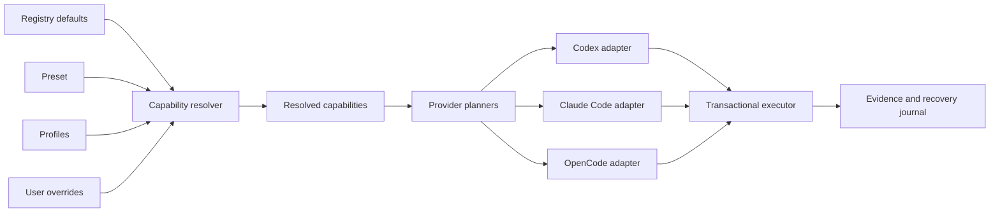

# Architecture

Orditra separates the stable intent of a capability from the provider that implements it and from the client adapter that renders it. This prevents a Codex-specific configuration detail from leaking into Claude Code or OpenCode and keeps optional tools out of unrelated sessions.

## Layers

1. `registry/capabilities.yaml` defines purpose, default mode, compatible providers, conflicts, and bundled skills.
2. `registry/providers.yaml` records immutable provenance, executable/transport details, supported clients, and risk properties.
3. `presets/*.yaml` choose a useful baseline without redefining providers.
4. `registry/profiles/*.yaml` group capabilities for a repository shape or explicit workflow.
5. `src/capabilities.ts` applies precedence and validates provider selection and conflicts.
6. `src/providers/` creates provider-specific plan items; `src/clients/` owns shared client configuration structures.
7. `src/planner.ts` produces a side-effect-free install plan.
8. `src/dependencies.ts` inventories active requirements, selects a platform installer only when its package manager exists, and keeps dependency consent separate from configuration consent.
9. `src/executor.ts` applies that plan atomically enough to recover, records a journal, and preserves backups until garbage collection proves them orphaned.
10. `src/reporting.ts` renders one stable finding model to terminal, JSON, Markdown, SARIF, or HTML.

The CLI entrypoint contains only bootstrap and error handling. Command registration is split under `src/cli/` into options, output/prompts, installation, diagnostics, lifecycle, project, configuration, and skill modules. This keeps command wiring separate from domain services and prevents client-facing growth from recreating a monolithic `cli.ts`.

## Availability, activation, and exposure

These are separate states:

- A provider is **available** when its metadata and workflow are registered.
- A capability is **activated** globally only in `auto` or `always` mode.
- A `project` capability is exposed through repository detection and project-local skills, not injected into every client session.
- A `registered` capability remains discoverable and explainable without incurring startup, tool-list, authentication, or context cost.

High-risk or authenticated providers default to `off`. Profiles may register them, but cannot silently supply credentials.

## Data ownership

| Data | Source of truth | Generated/managed targets |
| --- | --- | --- |
| portable user intent | user config schema v2 | client-specific blocks and MCP entries |
| capability semantics | `registry/capabilities.yaml` | resolved install plan |
| provider provenance/risk | `registry/providers.yaml` | health checks and provider commands |
| shared skills | `skills/` | client skill directories and project-local copies |
| external skills | `registry/skill-sources.lock.yaml` | verified release directories |
| project detection | repository files | `.orditra/project.yaml`, `.agents/skills/` |
| execution state | transaction journal | rollback, recovery, and garbage collection |

The repository never owns user secrets. Generated files contain stable public endpoints or executable definitions only; tokens stay in the client’s normal secret mechanism or environment.

## Search routing

Orditra keeps four code-understanding jobs distinct:

1. text search (`rg`) for exact strings and filenames;
2. structural search (ast-grep) for syntax patterns and controlled rewrites;
3. semantic navigation (Serena) for symbols, references, and precise edits;
4. repository maps or large-code search for bounded cross-file orientation.

The workflow router selects the smallest layer that can answer the question. It escalates only when simpler evidence cannot establish the relationship.

## Schema evolution

Schema v1 component flags remain readable. `orditra config migrate` plans an atomic conversion to schema v2 capability selections. Unknown keys, broken references, invalid modes, provider conflicts, incomplete source pins, symlink escapes, and mutable GitHub Action references fail validation.

## Distribution surfaces

The same repository is:

- an npm CLI package for all three clients;
- a Codex plugin through `.codex-plugin/plugin.json` and `.mcp.json`;
- a repo marketplace through `.agents/plugins/marketplace.json`;
- a portable skill source through `skills/*/SKILL.md`;
- a versioned registry that others can fork and customize.

The plugin bundles only a public Context7 endpoint. Context-mode, Serena, and other local providers are planned by the CLI because their installation and runtime differ by client and operating system.
