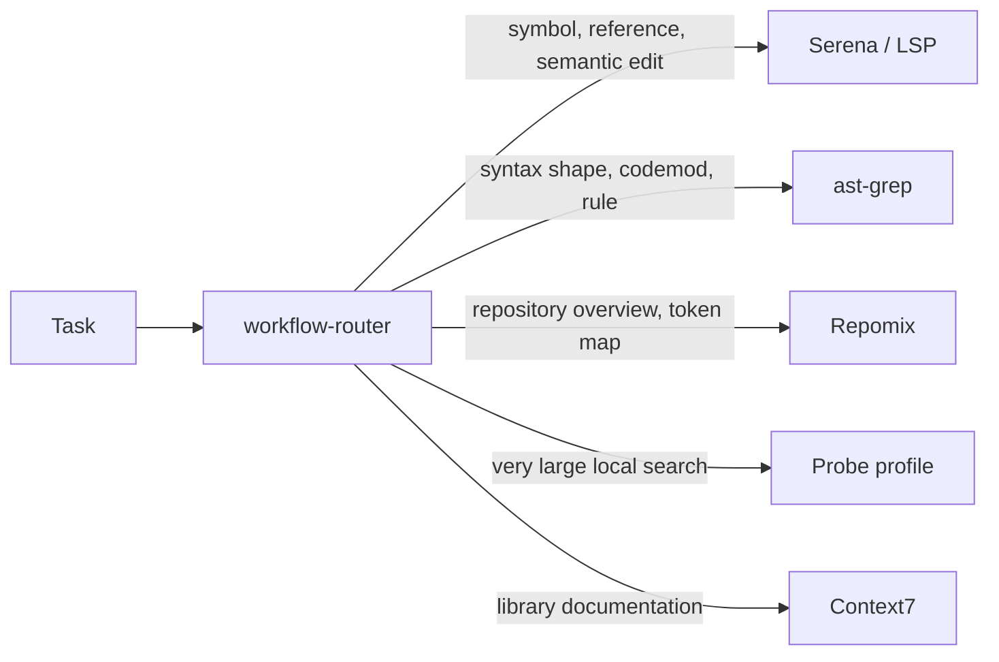

# Orditra ecosystem audit

> Implementation status (2026-08-12): the capability/provider/profile architecture, structured reports, project sync, transaction recovery, supply-chain verification, Codex plugin packaging, evals, security CI, and optional ecosystem profiles proposed below are implemented in the current working tree. This document remains the decision record and market map; `README.md` and `docs/architecture.md` describe current behavior.

Audit date: 2026-08-12
Scope: Orditra 0.1.2, 60 tracked files, 3,694 lines, Codex, Claude Code and OpenCode.

## Executive conclusion

Orditra already has the right foundations: one versioned source of truth, pinned external sources, transactional writes, rollback, client-specific policies, compact skills, context-mode, Serena, ast-grep and curated Matt Pocock skills.

The next improvement should not be a large bundle of always-on MCP servers. The highest-value change is a capability layer that can register many providers while exposing only the few relevant to the current project and task. This avoids duplicated tools, conflicting skill triggers, unnecessary MCP schemas in context, extra daemons and a larger supply-chain attack surface.

The target model should distinguish four states:

1. **Global core**: tiny, universal and always discoverable.
2. **Auto profile**: installed or enabled only after project detection.
3. **On demand**: available through the router but not injected into every session.
4. **Explicit opt-in**: authenticated, side-effectful, heavy or overlapping tools.

This is consistent with current Codex guidance: skills use progressive disclosure, repository-local skills are supported, duplicate names are not merged, and the initial skill listing has a bounded context budget. Skills should therefore be curated and scoped, not accumulated globally. See [Codex skills documentation](https://learn.chatgpt.com/docs/build-skills).

Baseline verification at audit time:

- `npm run check`: passed.
- Tests: 16 passed, 0 failed.
- Repository validation: passed.
- Git worktree before this report: clean.

## Recommended default stack

Here, “default” means registered by Orditra and safely available. It does not always mean that an MCP process or every tool schema must be active in every session.

| Capability | Packaging | Activation | Recommendation |
| --- | --- | --- | --- |
| Workflow router | Bundled skill | Global core | Keep one compact router globally visible. It should select capabilities, not duplicate their instructions. |
| Project bootstrap | Bundled skill | Global, explicit invocation | Keep. Extend it to detect the project and materialize a repo-local profile. |
| context-mode | Plugin/hooks | Global core | Keep. It is the primary guard against raw-output context flooding. |
| Serena | MCP + compact skill | Auto for code repositories | Keep as the semantic symbol, references and precise-edit provider. |
| ast-grep | CLI + compact skill | Auto for supported languages | Keep for AST patterns, rules and codemods. Do not present it as a semantic reference engine. |
| Context7 | MCP + routing rule | Registered by default; lazy/project enabled | Add. It supplies current, version-aware library documentation and is also used as an example in the [Codex MCP documentation](https://learn.chatgpt.com/docs/extend/mcp?surface=cli). |
| Repository map | Repomix CLI + compact skill | On demand; automatic above a size threshold | Add. Use signatures and per-file token counts without exposing another permanent MCP schema. [Repomix](https://github.com/yamadashy/repomix) supports Tree-sitter compression and token counting. |
| Agent component scan | `snyk-agent-scan` CLI gate | Before install/update and in CI | Add. Scan downloaded skills, MCP configurations and prompts before activation. [Agent Scan](https://github.com/snyk/agent-scan) targets agent and MCP supply-chain risks. Pin an exact version; never use `@latest` in generated configuration. |
| Dependency vulnerability scan | OSV-Scanner CLI | Auto when supported manifests exist; CI | Add. It is multi-ecosystem and can scan lockfiles/source trees. See [OSV-Scanner](https://github.com/google/osv-scanner). |
| Evidence report | New bundled skill + native renderers | Global core, invoked only for reports | Add. Produce one structured result and render terminal, JSON, Markdown, SARIF and self-contained HTML. Use Mermaid for portable diagrams. |
| GitHub Actions scan | zizmor CLI | Orditra maintainer CI; auto for projects with workflows | Add. It statically analyzes GitHub Actions. See [zizmor](https://github.com/zizmorcore/zizmor). |

### The code-intelligence stack should have non-overlapping roles



This separation matters. Serena, ast-grep, Repomix and Probe are complementary only when the router gives each one a precise role. Enabling all of them as unrestricted, always-visible MCP tools would create overlap rather than speed.

## Additions by profile

### Large codebase profile

Add [Probe](https://github.com/probelabs/probe) as an alternative provider, not as a second default semantic MCP beside Serena. Probe offers AST-aware complete code blocks, BM25 search, token limits, session deduplication, symbol operations and optional LSP indexing/call hierarchy. Good activation conditions include:

- repository above a configurable file/token threshold;
- repeated search across many modules;
- Serena language server unavailable or too expensive to initialize;
- read-heavy discovery where no semantic edit is planned.

For a future native repository map, borrow the design of [Aider's repo map](https://aider.chat/docs/repomap.html): rank a dependency/symbol graph and fit the most relevant symbols into an explicit token budget. Do not install Aider itself as an Orditra runtime dependency.

[SCIP](https://github.com/scip-code/scip) is worth tracking as a future interchange format for persistent, cross-language symbol graphs. It is a protocol layer, not an immediate default end-user tool.

### Web project profile

Prefer [Playwright CLI + skills](https://github.com/microsoft/playwright-cli) for routine coding-agent browser work. The Playwright MCP project itself notes that CLI-plus-skill workflows can be more token-efficient because they avoid permanently loading large tool schemas and accessibility trees. Keep [Playwright MCP](https://github.com/microsoft/playwright-mcp) for persistent exploratory browser loops.

Add [Chrome DevTools MCP](https://github.com/ChromeDevTools/chrome-devtools-mcp) only in a `web-performance` profile for traces, network inspection and console diagnostics. Do not enable Playwright MCP and Chrome DevTools MCP globally together.

### Dependency and architecture profile

Add [dependency-cruiser](https://github.com/sverweij/dependency-cruiser) for JavaScript/TypeScript dependency graphs and enforceable architecture constraints. It complements Serena: Serena answers symbol questions; dependency-cruiser validates module-boundary policy.

For multi-language graphs, use a provider interface rather than making dependency-cruiser a universal dependency.

### Security profile

Default CI and install gates:

- Agent Scan for skills/MCP/prompts;
- OSV-Scanner for dependency vulnerabilities;
- zizmor for GitHub Actions;
- Gitleaks, already present;
- GitHub CodeQL for supported languages;
- full-commit SHA pinning for GitHub Actions, updated by Dependabot;
- generated SBOM plus the existing release checksums and attestations;
- [OpenSSF Scorecard](https://github.com/ossf/scorecard) for the public repository.

Optional deeper tools:

- [Trivy](https://github.com/aquasecurity/trivy) for containers, IaC and broader filesystem scanning;
- [Semgrep](https://github.com/semgrep/semgrep) for security rules beyond structural ast-grep checks;
- [Joern](https://github.com/joernio/joern) for heavyweight code-property-graph analysis;
- the official Codex Security plugin when the account and surface support it. Plugins can contain skills, connectors, MCP servers and hooks, but plugins are not supported in the IDE extension; Orditra must model that difference. See [OpenAI plugin documentation](https://learn.chatgpt.com/docs/plugins).

### MCP hardening profile

[ToolHive](https://github.com/stacklok/toolhive) is a strong optional provider for teams that need isolated MCP execution, a curated registry, authentication, audit logs and observability. It should not be a default local dependency because it adds runtime and operational weight.

Use the official [MCP Inspector](https://github.com/modelcontextprotocol/inspector) only for Orditra integration tests and provider development, not as an end-user tool loaded into sessions.

### Authenticated service profile

Offer the official [GitHub MCP server](https://github.com/github/github-mcp-server) as an explicit profile. It is valuable but authenticated and side-effectful, so it must never be silently enabled. The same rule should apply to issue trackers, email, Slack, cloud providers and databases.

### Local knowledge profile

[qmd](https://github.com/tobi/qmd) is useful for local Markdown knowledge bases, but it overlaps with context-mode's persistent FTS layer. Offer it only where a project has a large document corpus and needs hybrid local retrieval. Do not add two default local indexes.

### Evaluation profile

Add [Promptfoo](https://github.com/promptfoo/promptfoo) to Orditra's maintainer workflow. Use it to test routing, skill triggering, refusal boundaries, token use and cross-client behavioral parity. These are product tests for the agent layer, not a runtime dependency for every user.

Minimum eval corpus:

- each skill triggers on positive examples;
- it does not trigger on close negative examples;
- the router chooses one primary provider for overlapping tasks;
- destructive or authenticated tools require explicit intent;
- large-output tasks route through context-mode;
- the same project request produces equivalent plans in Codex, Claude Code and OpenCode;
- report output remains valid Markdown, JSON and SARIF.

## Visual and machine-readable reports

Add a single internal finding model rather than formatting messages independently inside every command:

```ts
interface Finding {
  id: string;
  capability: string;
  status: "pass" | "info" | "warning" | "error";
  summary: string;
  evidence?: string[];
  remediation?: string;
  source?: string;
  durationMs?: number;
}
```

Recommended command surface:

```text
orditra doctor --format terminal
orditra doctor --format json --output report.json
orditra doctor --format markdown --output report.md
orditra doctor --format sarif --output report.sarif
orditra doctor --format html --output report.html
orditra map --budget 2000 --format markdown
orditra report --include doctor,security,skills,tools
```

Rendering policy:

- terminal: compact status table, TTY colors, `NO_COLOR` support;
- Markdown: portable tables plus Mermaid diagrams;
- JSON: stable versioned schema for automation;
- SARIF: security and validation findings consumable by GitHub code scanning;
- HTML: self-contained, no external scripts, with collapsible evidence and redacted local paths;
- D2: optional export profile for polished architecture diagrams, not a core runtime dependency;
- no remote telemetry by default; an OpenTelemetry exporter may be opt-in.

## Skill strategy

The current recommended preset contains Orditra skills plus a curated Matt Pocock set. Keep the integration, but change how it is exposed:

1. Install only the router and truly universal skills globally.
2. Keep a versioned skill catalog and lockfile in Orditra.
3. Detect project languages/frameworks during `orditra project init` or `orditra project sync`.
4. Materialize relevant skills in repository-local `.agents/skills`.
5. Validate unique names across every discovered scope.
6. Track source commit, content SHA-256, license, attribution, review date, risk class and compatible hosts per skill.
7. Provide `orditra skills explain <name>` to show why a skill is active and where it came from.

Useful new compact Orditra-authored skills:

| Skill | Purpose | Default scope |
| --- | --- | --- |
| `evidence-report` | Turn structured findings into concise Markdown/Mermaid/SARIF reports. | Global core |
| `verification-gate` | Require relevant checks and concrete evidence before declaring completion. | Global core |
| `large-codebase-map` | Route between Serena, Repomix and Probe using explicit token budgets. | Auto for large repositories |
| `dependency-architecture` | Build and validate dependency boundaries. | JS/TS and later language profiles |
| `agent-supply-chain` | Audit new skills, MCP servers, hooks, permissions and source pins. | Maintainer/security profile |
| `current-docs` | Route library/API questions to Context7 or primary official docs. | Global core, compact |
| `browser-qa` | Prefer Playwright CLI; escalate to MCP only for persistent sessions. | Web profile |
| `performance-report` | Capture web traces and convert them into evidence-backed findings. | Web-performance profile |

Do not install complete third-party skill collections indiscriminately:

- [Superpowers](https://github.com/obra/superpowers) is a coherent alternative methodology, but it overlaps with Matt Pocock's workflow skills and can create competing triggers. Offer it as an alternative preset.
- [Vercel skills](https://github.com/vercel-labs/skills) are useful as a compatibility source and for framework-specific curation; do not delegate Orditra installation to a second global skill manager.
- Large collections such as Anthropic's skills must be curated per folder, with explicit license and security review, before vendoring or redistribution.

## Architecture changes required before adding many providers

### 1. Replace closed booleans with capabilities

The current `Components` type is a fixed list of booleans. Replace it with a versioned capability model:

```yaml
capabilities:
  semantic-code:
    mode: auto
    provider: serena
  structural-search:
    mode: auto
    provider: ast-grep
  repository-map:
    mode: on-demand
    provider: repomix
    options:
      tokenBudget: 2000
  current-docs:
    mode: auto
    provider: context7
  browser-qa:
    mode: project
    provider: playwright-cli
```

Supported modes should be `off`, `registered`, `auto`, `project`, and `always`. A provider declares dependencies, conflicts, supported clients, install method, risk, health checks and output formats.

### 2. Split the planner

`src/planner.ts` is the largest and most branched file. Split it into:

```text
src/planning/core.ts
src/capabilities/registry.ts
src/providers/context-mode.ts
src/providers/serena.ts
src/providers/ast-grep.ts
src/providers/context7.ts
src/clients/codex.ts
src/clients/claude.ts
src/clients/opencode.ts
src/reporting/*
```

Each provider should implement `detect`, `planInstall`, `planUninstall`, `doctor` and `describeRisk`. Each client adapter should translate provider intent into its native configuration without putting client conditionals in the core planner.

### 3. Introduce schema-backed registries

Use checked-in JSON Schema and Ajv validation for public YAML/JSON inputs. Recommended registries:

- `registry/capabilities.yaml`;
- `registry/providers.yaml`;
- `registry/profiles/*.yaml`;
- `registry/reporters.yaml`;
- `registry/compatibility.yaml`;
- `registry/security-policy.yaml`.

Keep the existing registries as migration inputs for schema version 2. Avoid making TypeScript interfaces the only schema because editors and third-party installers need a portable contract.

### 4. Add a reproducible capability lockfile

Every external artifact should record:

- repository and immutable commit;
- subpath and content SHA-256;
- release/package version when relevant;
- license and required attribution;
- last review date and reviewer policy version;
- whether it runs code, uses the network, reads outside the project, adds hooks or performs writes;
- supported host versions and platforms.

No generated config should use an unpinned `npx ...@latest`, floating Git branch or floating GitHub Action tag.

### 5. Separate availability from activation

Installation, discovery and session exposure are different states. Orditra should report all three. This permits one versioned catalog while keeping the active context small.

## File-by-file review

### Root and package files

| File | Current role | Finding and recommended change |
| --- | --- | --- |
| `.gitattributes` | Repository text normalization | Keep. Add explicit generated/binary treatment only when HTML/SARIF fixtures or diagram assets are introduced. |
| `.gitignore` | Build and local-state exclusions | Keep. Add report output directories only if generated reports are not intended to be versioned. Never ignore lockfiles or registry digests. |
| `CHANGELOG.md` | Public release history | Keep. Add migration notes when capability schema v2 changes user config. |
| `CONTRIBUTING.md` | Contributor workflow | Add provider checklist, security review requirements, schema/eval tests and exact source-pin policy. |
| `LICENSE` | Project licensing | Keep MIT. Add a generated `THIRD_PARTY_NOTICES.md` once more external skills/tools are redistributed. |
| `PIANO-CONFIGURAZIONE-AGENTI-LLM.md` | Original product plan | Mark implemented/obsolete decisions and link to current architecture ADRs; otherwise it can diverge from reality. |
| `README.md` | Public entry point | Add a capability matrix, profiles, threat model summary, `project sync`, report examples and an explanation of registered versus active tools. |
| `SECURITY.md` | Vulnerability reporting | Add MCP/skill threat model, supported release window, disclosure SLA and instructions for malicious-skill reports. |
| `package-lock.json` | Reproducible npm graph | Keep committed. Validate with OSV and generate an SBOM during release. |
| `package.json` | CLI metadata and scripts | `check` currently builds twice through nested scripts. Split `build`, `test:compiled`, `test`, `lint`, `coverage`, `validate`, `eval` and `check` without redundant compilation. Add schema/report dependencies only when used. |
| `tsconfig.json` | TypeScript compiler policy | Keep strictness. Consider `noUncheckedIndexedAccess` and `exactOptionalPropertyTypes`; adopt incrementally because both reveal real boundary bugs. |

### GitHub automation

| File | Current role | Finding and recommended change |
| --- | --- | --- |
| `.github/dependabot.yml` | Monthly npm/Actions updates | Keep. Configure grouped safe updates and ensure full-SHA-pinned Actions remain updatable. |
| `.github/workflows/publish-npm.yml` | OIDC npm publishing | Keep trusted publishing. Add environment protection and verify the exact artifact digest before publish. |
| `.github/workflows/release.yml` | Tarball, checksum and attestation | Strong foundation. Add SBOM/provenance attachment and third-party notice verification. |
| `.github/workflows/validate.yml` | Node/macOS/Ubuntu validation and Gitleaks | Add CodeQL, OSV-Scanner, zizmor, actionlint, Scorecard and coverage. Pin every action to a full commit SHA. Keep heavy scans in separate jobs. |

### Configuration, documentation and policies

| File | Current role | Finding and recommended change |
| --- | --- | --- |
| `ast-grep/base-sgconfig.yml` | Base structural-search config | Keep minimal. Add project-local rule discovery and a versioned ruleset registry; do not turn generic style preferences into global rules. |
| `config/config.yaml` | Versioned shared defaults | Evolve to capability modes, providers, profiles, risk policy and activation rules. Preserve a simple schema-v1 migration. |
| `docs/architecture.md` | Current architecture | Add capability/provider/client boundaries, data flow, trust boundaries and report pipeline. Use Mermaid source committed as text. |
| `docs/public-release-checklist.md` | Release readiness | Add SBOM, OSV, agent-scan, skill license/digest verification, action SHA validation and behavioral eval results. |
| `docs/workflows.md` | Lifecycle documentation | Add activation/deactivation, project detection, security quarantine and provider failure/fallback flows. |
| `policies/core.md` | Shared agent rules | Keep very short. Add only universal rules: provider routing, least privilege, primary-source docs and structured evidence. |
| `policies/codex.md` | Codex adapter policy | Model repo-local skills, project MCP config, plugin support by surface and the bounded skill-list budget. |
| `policies/claude.md` | Claude Code adapter policy | Add manual/model invocation controls, allowed tools and context-budget-aware skill descriptions. |
| `policies/opencode.md` | OpenCode adapter policy | Add its project/global skill discovery paths and native remote/local MCP representation. |

### Presets and registries

| File | Current role | Finding and recommended change |
| --- | --- | --- |
| `presets/minimal.yaml` | Policies plus bundled skills | Keep as the zero-network, low-risk profile. |
| `presets/recommended.yaml` | All current components plus Matt core | Replace “everything on” with core plus `auto` capabilities. Project-local skill materialization should be the default. |
| `presets/full.yaml` | Full stable Matt set and all components | Rename semantically to an explicit compatibility/expanded profile, warn about skill-context pressure, and avoid always-on MCP exposure. |
| `registry/mcp.yaml` | Serena MCP definition | Generalize to provider definitions with transport, instructions, health checks, permissions, pin/digest and per-client adapters. Add Context7 only after this schema exists. |
| `registry/skill-sources.lock.yaml` | Immutable external skill sources | Good start. Add content digests, per-skill license/attribution, review date, risk flags and supported hosts. |
| `registry/tools.yaml` | context-mode, Serena and ast-grep versions | Add install method, binary checksum/signature, platforms, update channel, conflicts and doctor commands. Avoid duplication with `mcp.yaml` through references. |
| `registry/workflows.yaml` | Lifecycle stage-to-skill routing | Good abstraction. Add security, current-docs, reporting, web QA, performance, evaluation and release stages. Add conflict/priority rules. |

### Scripts

| File | Current role | Finding and recommended change |
| --- | --- | --- |
| `scripts/clean.mjs` | Build cleanup | Keep narrowly scoped and explicit. Do not extend it to user config or release backups. |
| `scripts/postbuild.mjs` | Copies runtime assets | Generate or verify an asset manifest with SHA-256 so missing or stale registry files fail the build. |

### Bundled skills

| File | Current role | Finding and recommended change |
| --- | --- | --- |
| `skills/project-bootstrap/SKILL.md` | Project marker bootstrap | Extend from marker creation to detect-and-propose. It should not silently install authenticated or heavy providers. |
| `skills/serena-symbolic-code/SKILL.md` | Semantic navigation/editing | Keep. Add explicit fallback conditions and a prohibition on duplicating structural ast-grep tasks. |
| `skills/serena-symbolic-code/references/tool-routing.md` | Serena tool choice | Add initialization cost, supported-language and timeout/fallback guidance. |
| `skills/structural-code-search/SKILL.md` | AST-aware search/rewrite | Keep. Add validation requirements for rewrites and scope guards for generated/vendor code. |
| `skills/structural-code-search/references/patterns.md` | ast-grep examples | Expand with tested multi-language examples and unsafe rewrite counterexamples. |
| `skills/workflow-router/SKILL.md` | Main workflow router | Make it the only global discovery hub. It should consult capability metadata and explain why a provider was selected. |
| `skills/workflow-router/references/routing.md` | Lifecycle routing matrix | Add capability conflicts, escalation rules and project-profile conditions. Keep the main skill compact. |

### TypeScript source

| File | Current role | Finding and recommended change |
| --- | --- | --- |
| `src/cli.ts` | Argument parsing and command dispatch | At 203 lines it is still manageable, but new report/profile/provider commands will make the ad-hoc parser fragile. Move to command modules and a schema-driven parser before expanding the CLI. |
| `src/commands.ts` | Binary lookup and subprocess execution | It buffers output and only exposes a truncated error tail. Add streaming-to-file, timeouts, cancellation, redaction and structured execution results. Route large output through analyzers rather than returning it to the model. |
| `src/doctor.ts` | Binary/config/skill health checks | Add provider handshakes, pin/digest drift, source freshness, permission/risk checks, severity/remediation and structured report output. |
| `src/executor.ts` | Atomic apply, backup, rollback and external skill copy | Strong core. Add content-digest verification, quarantine before activation, failure injection tests, backup/release garbage collection and explicit recovery journal states. |
| `src/jsonc.ts` | Comment-preserving JSONC changes | Keep. Add fixture tests for trailing commas, BOM, duplicate-like paths and formatting preservation. |
| `src/managed-block.ts` | Idempotent managed Markdown block | Keep. Add malformed/nested marker and concurrent-change tests. |
| `src/paths.ts` | Cross-client/XDG path resolution | Add Windows path tests, portable-mode root support and explicit separation between global, project and release paths. |
| `src/planner.ts` | Entire install plan across clients and tools | Primary hotspot: 358 lines, with a roughly 228-line install-plan function and client/provider conditionals. Split into provider and client adapters before adding integrations. |
| `src/project.ts` | Creates schema-v1 project marker | Expand to detect languages/frameworks and generate a reviewed repo-local profile, skills and knowledge manifest. Add `project diff` and `project sync`. |
| `src/registry.ts` | Loads YAML registries and package version | Add JSON Schema validation, registry composition, schema migrations and provenance-aware errors. |
| `src/types.ts` | Closed config/plan types | Replace fixed component booleans with capability/provider/mode types. Add structured findings, risk metadata and report formats. |
| `src/user-config.ts` | Layered shared/local config | Preserve one-file management. Add profile inheritance, per-capability options, explicit secret references, unknown-provider errors and `config explain`. |
| `src/validate.ts` | Repository and registry checks | Add duplicate skill-name detection across scopes, JSON Schema, digest/license validation, symlink escape checks, action pin checks and Agent Scan integration. |

### Tests

| File | Current role | Finding and recommended change |
| --- | --- | --- |
| `test/integration/install.test.ts` | Install/idempotency/migration/release upgrade | Good core coverage. Add partial-failure recovery, provider conflicts, quarantine, digest mismatch and all-client profile fixtures. |
| `test/integration/validate.test.ts` | Repository validates | Keep as smoke test. Add intentionally invalid fixture repositories so every validation rule is proven. |
| `test/integration/workflows.test.ts` | Lifecycle stages exist | Add route uniqueness, priority, conflict and positive/negative trigger cases. |
| `test/unit/jsonc.test.ts` | JSONC mutation | Expand formatting and malformed-input fixtures. |
| `test/unit/managed-block.test.ts` | Managed Markdown blocks | Expand marker corruption, CRLF and concurrent manual-edit cases. |
| `test/unit/project.test.ts` | Project marker creation | Add language/profile detection, dry run, existing-project merge and repo-local materialization. |
| `test/unit/user-config.test.ts` | Layered config loading | Add schema migrations, capability modes, provider options, local secret references and invalid inheritance. |

Missing dedicated test modules should be added for `cli`, `commands`, `doctor`, `executor`, `paths`, `planner`, `registry` and `validate`. Add coverage thresholds only after these behavioral seams are covered; mutation testing can then target planner/validator decisions.

## Libraries worth adding to Orditra itself

These are implementation dependencies, not agent tools:

| Library/category | Recommendation | Reason |
| --- | --- | --- |
| Ajv + JSON Schema | Add | Portable validation for YAML/JSON registries and editor integration. |
| CLI parser (`commander` or similarly small typed parser) | Add when command modules are split | Prevent hand-written parsing complexity as profiles/report formats grow. |
| `picocolors` | Optional | Minimal TTY color with `NO_COLOR`; no need for a large UI framework. |
| `cli-table3` or a tiny internal table renderer | Optional | Stable doctor/report matrices. JSON/Markdown/SARIF matter more than terminal decoration. |
| Mermaid text output | Add natively | Most portable visual report format; CLI renderer only when exporting images. |
| D2 | Optional profile | Higher-quality architecture exports without making it a core dependency. |
| dependency-cruiser | Project provider | Architecture enforcement for JS/TS, not an Orditra runtime dependency. |
| OpenTelemetry | Opt-in exporter only | Useful for teams, but remote telemetry would violate the expected local-first default. |

Avoid adding a large framework merely to reduce a few local utility functions. Orditra's current two runtime dependencies are an advantage.

## What should not be enabled by default

- Multiple semantic/code-search MCPs with overlapping tools.
- Both Playwright MCP and Chrome DevTools MCP in every project.
- Authenticated GitHub, Slack, email, cloud or database connectors.
- Entire third-party skill catalogs.
- Hooks from unreviewed plugins.
- Remote telemetry.
- Tool commands using floating versions such as `@latest`.
- Direct universal-ctags integration when Serena/Probe already provide higher-level symbol routes.
- Heavy Semgrep, Trivy or Joern scans on every ordinary install.
- A second global skill installer competing with Orditra's lockfile and lifecycle.

## Prioritized implementation roadmap

### P0 — architecture and safety

1. Capability/provider/profile schema v2 with JSON Schema validation.
2. Split `src/planner.ts` into core, providers and client adapters.
3. Model availability, activation and session exposure separately.
4. Content digests, risk metadata, quarantine and Agent Scan gate.
5. Structured `Finding` model and terminal/JSON/Markdown/SARIF renderers.
6. Full-SHA GitHub Actions, zizmor, OSV, CodeQL and SBOM.

### P1 — high-value capabilities

1. Context7 provider.
2. Repomix repository-map provider with explicit token budget.
3. Project detection and repo-local skill materialization.
4. `evidence-report`, `verification-gate`, `current-docs` and `large-codebase-map` skills.
5. `doctor --format ...`, `config explain`, `skills explain`, `project diff/sync`.
6. Promptfoo behavioral eval suite.

### P2 — project profiles

1. Playwright CLI web profile and optional Playwright MCP mode.
2. Chrome DevTools web-performance profile.
3. Probe large-codebase alternative provider.
4. dependency-cruiser architecture profile.
5. GitHub MCP authenticated profile.
6. qmd local-knowledge profile.

### P3 — advanced and team use

1. ToolHive hardened MCP runtime.
2. Codex Security, Semgrep, Trivy and Joern profiles.
3. Optional OpenTelemetry exporter and fleet reports.
4. SCIP-backed persistent multi-repository symbol graph if real usage justifies it.

## Success criteria

The next architecture is successful when:

- a user edits one versioned config and all supported clients converge;
- a new provider is added without editing the core planner or unrelated client adapters;
- an ordinary project exposes fewer, more relevant skills/tools than today;
- every external artifact is pinned, hashed, licensed and reviewed;
- Orditra can explain why each capability is installed and active;
- reports are human-readable and machine-ingestible from the same findings;
- symbolic, structural, repository-map and documentation tasks route to distinct providers;
- the full cross-client behavior is covered by automated tests and evals.
